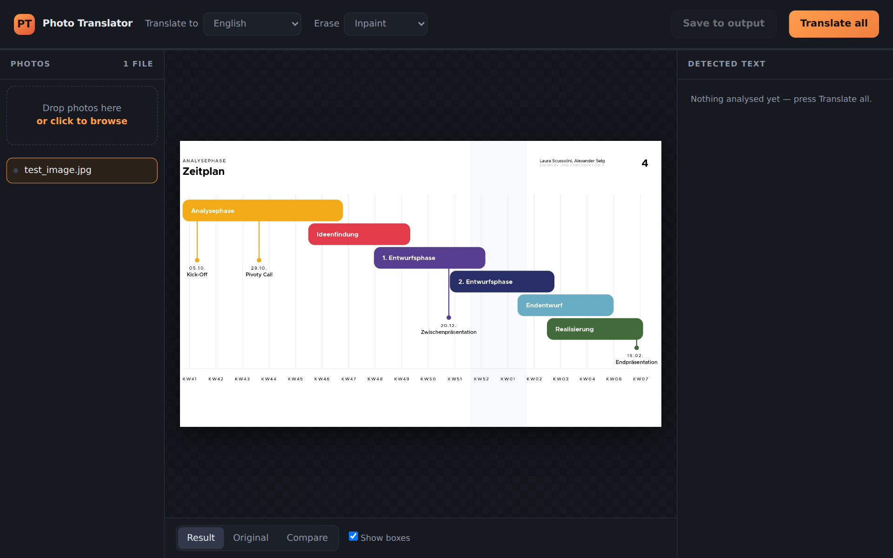
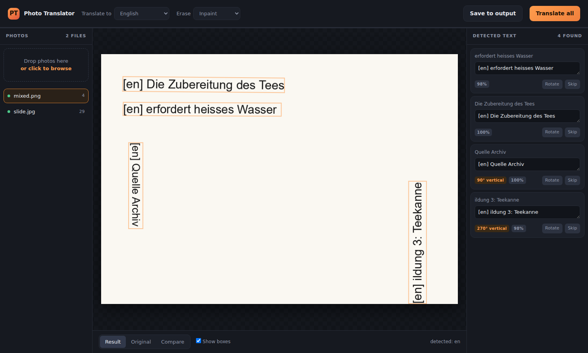

# Photo Translator

Translates the text inside photos and scans and puts the translation back in the same place, at the same angle and roughly the same ink color. Works offline after the first language pack download.





## Run

Windows:

```
run.bat
```

First run creates a venv and installs everything, then opens the UI at `http://127.0.0.1:8731`.

Anywhere else:

```
pip install -r requirements.txt
python PhotoTranslator.py                 # UI
python PhotoTranslator.py --batch --to fa # input/ -> output/, no UI
```

A new target language downloads its pack once (~100 MB). To grab it ahead of time:

```
python PhotoTranslator.py --setup --to fa
```

## UI

Drop photos in, pick a language, Translate all. Per box you can also:

- edit the translation (re-renders without re-running OCR)
- skip it (page numbers, logos, watermarks)
- rotate it 90 degrees if orientation was guessed wrong
- compare before/after with a slider

## CLI

```
python PhotoTranslator.py --batch --from de --to fa
python PhotoTranslator.py photo.jpg
python PhotoTranslator.py --batch --debug-boxes
```

| flag | env | default | |
|---|---|---|---|
| `--from` | `PT_FROM` | `auto` | source language |
| `--to` | `PT_TO` | `en` | target language |
| `--ocr` | `PT_OCR` | `auto` | `rapidocr`, `unlimited`, `auto` |
| `--erase` | `PT_ERASE` | `inpaint` | `inpaint`, `fill`, `none` |
| `--font` | `PT_FONT` | auto | TTF to typeset with |
| `--input` / `--output` | `PT_INPUT` / `PT_OUTPUT` | `./input`, `./output` | |
| `--overwrite` | `PT_OVERWRITE` | off | |
| `--port` | | 8731 | |

Language pairs without a direct pack (e.g. German to Persian) go through English automatically.

## OCR

| | engine | needs | size |
|---|---|---|---|
| default | RapidOCR (ONNX) | any CPU | ~15 MB |
| optional | Unlimited-OCR | NVIDIA GPU | several GB |

The GPU tier is only used if it's installed:

```
pip install torch --index-url https://download.pytorch.org/whl/cu121
pip install transformers accelerate
```

## Pipeline

load -> OCR -> per-box orientation check -> translate -> erase original (inpaint) -> shape text (RTL aware) -> render at the box angle

## Build an .exe

```
make_exe.bat
```

or `python build_portable.py`.

## Tests

```
python -m pytest tests
```

## License

MIT
